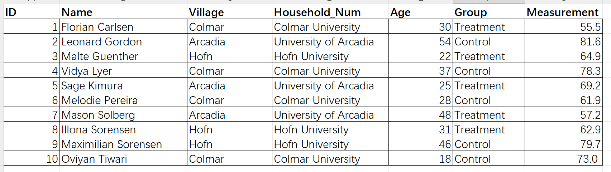

# Lab 6  Island Design

#### NAME: Yiran Hu         NetID: yiranhu3

#### Q1.

I will use "drink Cola Caffeinated 250 mL" as treatment factor and use "time of swimming freestyle 50 m" as response variable. I think it's useful to know whether drinking cola with caffeine truly has some effects on swimming.

#### Q2.

Population: The university students in Hofn, Arcadia and Colmar on the three islands.

#### Q3.

Does drinking cola with caffeine affect the swimming freestyle performance for University students across the three islands?

#### Q4.

###### a. 

I choose randomized controlled experiment with post-measures only design.

###### b.

I want to use random assignment with blocking. Firstly, block people by gender because I think swimming performance depends on gender. Male may swim faster than female on average. Then randomly assign people in each block to treatment and control groups.

###### c.

The treatment group needs to drink 250 ml Cola Caffeinated before swimming. The control also needs to take a placebo which is drinking 250 ml water. The treatment group and control group should do the test at the same time and place in the same day. This will mitigate the potential impact of the "timing effect".

#### Q5.

###### a. group selection: not apply

Because the treatment and control group are all university students and I will use randomly assignment with blocking to guard against systematic differences.

###### b. setting: apply

Reactance: Students will probably know they are being studied if I ask them to drink Cola Caffeinated. But this is not very serious because this experiment is not a pre-post design. I already have a control group. Researcher Effect: The researchers may know what this experiment is going to do and interact with participants in a different way.

But the Placebo Effect and Environment Condition Differences in Setting Effects does not apply. Because the control group will take a placebo and the environment setting is the same.

###### c. Timing: not apply

The applicants will drink Cola Caffeinated or water at the same time, and take swimming test at the same place.

###### d. Test Familiarity: not apply

Because participants will not get an opportunity  to practice or learn from the test. This is a randomized controlled experiment.

#### Q6.

